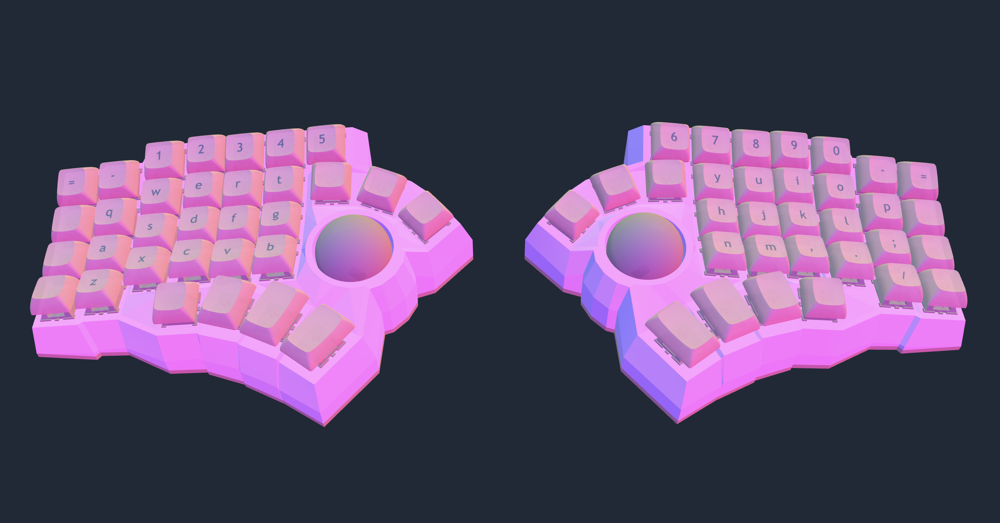

# QMK Userspace - Geoff's Keyboards

This repository contains my personal QMK keyboard configurations using the QMK Userspace feature.

## Keyboards

### a_test - Handwired 7x5 Cosmos Dactyl with Trackball




A handwired split ergonomic keyboard with:

- **Controllers**: RP2040-Zero (both sides)
- **Trackball**: PMW3389 on the right side only (for now)
- **Keys**: 70 keys total (5 rows × 7 columns per side)
- **Communication**: Serial USART between halves
- **Features**: Auto-mouse layer support, Caps Word
- **3D Print Files**: [Cosmos Generator](https://ryanis.cool/cosmos/beta#cm:CpQCChYSBRCASyAnEgUQkEEgExICIAASADgxChYSBRCAVyAnEgUQkE0gExICIAASADgdCi4SCRCAYyAnQICAKBIJEJBZIBNAgIAoEgYgAECAgCgSBxCwL0CAgCg4CECA8KQBChkSBRCAbyAnEgUQkGUgExICIAASAxCwOzgKCigSCBCAFyAnQIBQEggQkHEgE0CAWBIFIABAgFASA0CAUDgeQICGivABCiESBRCAIyAnEgQQECATEgYQoIAKIAASAhAwODJAgIaK8AIKFRIFEIA/ICcSChAQIBNAI0iAhh44RQolEhAQECATQOui/QFI2YaekO4BEg8gAED/h4i5B0jZhp6AngQ4WRgAQOiFoK7wVUjcoJdgCpUBCj4SERAgQIKD2LMBSIOdvKP5AVAdEhFAmoSGyAVIh52EnsDwAVCqARITCIAoEEBAqJiGuBxIh52EHlDyAlCafQocEhQQMECYg8CMsFhIh52EnpD/AlC6BDCAIFDofAobEhQQQCAAMMgBQJmUm5ADSIDAruDYAjCWIDgAGAoiBRDIASAAMIAwQNuRpJzwN0iEj5TWoHgQAiILCMMBEMMBGAAg0AU4AoIBAgQCWEdoAA==)

## Setup

### Prerequisites

1. Install QMK CLI:

   ```bash
   python3 -m pip install --user qmk
   ```

2. Setup QMK:
   ```bash
   qmk setup
   ```

### Using this Userspace

1. Clone this repository:

   ```bash
   git clone https://github.com/geoffmiller/qmk_userspace.git ~/qmk_userspace
   cd ~/qmk_userspace
   ```

2. Set QMK userspace:

   ```bash
   qmk config user.overlay_dir="$(realpath .)"
   ```

## Flashing

### Initial Setup (One-time)

To ensure the correct handedness for each side, use the specific keymaps for each half. This stores the handedness in EEPROM so it persists across firmware updates.

**Flash Left Side:**
Connect the left half in bootloader mode and run:

```bash
qmk flash -kb handwired/a_test -km force_left
```

**Flash Right Side:**
Connect the right half in bootloader mode and run:

```bash
qmk flash -kb handwired/a_test -km force_right
```

### Regular Updates

After the initial setup, you can flash the default keymap to either side (or both) and they will remember their handedness:

```bash
qmk flash -kb handwired/a_test -km default
```

**Note:** You only need to use `force_left` or `force_right` again if you clear the EEPROM or perform a factory reset.

### Entering Bootloader Mode

Enter the bootloader in 3 ways:

- **Bootmagic reset**: Hold down ESC (top left key) and plug in the keyboard
- **Physical reset button**: Briefly press the button on the back of the RP2040-Zero
- **Keycode in layout**: Press the key mapped to `QK_BOOT` (available on Layer 1 left thumb and Layer 2 right thumb)

## Keymap Layouts

### Layer 0 (Base Layer)

```
Left Half:                                          Right Half:
┌─────┬─────┬─────┬─────┬─────┬─────┬─────┐      ┌─────┬─────┬─────┬─────┬─────┬─────┬─────┐
│ ESC │  `  │  1  │  2  │  3  │  4  │  5  │      │  6  │  7  │  8  │  9  │  0  │  -  │  =  │
├─────┼─────┼─────┼─────┼─────┼─────┼─────┤      ├─────┼─────┼─────┼─────┼─────┼─────┼─────┤
│ TAB │  Q  │  W  │  E  │  R  │  T  │BTN1 │      │BTN1 │  Y  │  U  │  I  │  O  │  P  │  \  │
├─────┼─────┼─────┼─────┼─────┼─────┼─────┤      ├─────┼─────┼─────┼─────┼─────┼─────┼─────┤
│LSHFT│  A  │  S  │  D  │  F  │  G  │BTN2 │      │VOL+ │  H  │  J  │  K  │  L  │  ;  │ '⇧  │
├─────┼─────┼─────┼─────┼─────┼─────┼─────┤      ├─────┼─────┼─────┼─────┼─────┼─────┼─────┤
│LSHFT│ Z⌃  │  X  │  C  │  V  │  B  │MUTE │      │VOL- │  N  │  M  │  ,  │  .  │  /  │RSHFT│
├─────┼─────┼─────┼─────┼─────┼─────┼─────┤      ├─────┼─────┼─────┼─────┼─────┼─────┼─────┤
│  ✗  │  ✗  │ ALT │ GUI │ SPC │LT1⏎ │  ✗  │      │  ✗  │LT2⏎ │BSPC │ GUI │ ALT │  ✗  │  ✗  │
└─────┴─────┴─────┴─────┴─────┴─────┴─────┘      └─────┴─────┴─────┴─────┴─────┴─────┴─────┘

Legend:
  Z⌃   = Hold: Left Ctrl, Tap: Z
  '⇧   = Hold: Right Shift, Tap: '
  LT1⏎ = Hold: Layer 1, Tap: Enter
  LT2⏎ = Hold: Layer 2, Tap: Enter
  BTN1/BTN2 = Mouse Buttons 1 & 2
  ✗    = No key
```

### Layer 1 (Navigation & Brackets)

```
Left Half:                                          Right Half:
┌─────┬─────┬─────┬─────┬─────┬─────┬─────┐      ┌─────┬─────┬─────┬─────┬─────┬─────┬─────┐
│ TO0 │     │     │     │     │     │     │      │     │     │     │  (  │  )  │     │ TO1 │
├─────┼─────┼─────┼─────┼─────┼─────┼─────┤      ├─────┼─────┼─────┼─────┼─────┼─────┼─────┤
│     │     │     │     │     │     │     │      │     │     │     │  [  │  ]  │     │     │
├─────┼─────┼─────┼─────┼─────┼─────┼─────┤      ├─────┼─────┼─────┼─────┼─────┼─────┼─────┤
│CAPS │     │     │     │     │     │     │      │     │     │     │  {  │  }  │     │     │
├─────┼─────┼─────┼─────┼─────┼─────┼─────┤      ├─────┼─────┼─────┼─────┼─────┼─────┼─────┤
│CAPS │     │     │     │     │     │BOOT │      │     │  ←  │  ↓  │  ↑  │  →  │     │     │
├─────┼─────┼─────┼─────┼─────┼─────┼─────┤      ├─────┼─────┼─────┼─────┼─────┼─────┼─────┤
│  ✗  │  ✗  │     │     │     │     │  ✗  │      │  ✗  │  ←  │  ↓  │  ↑  │  →  │  ✗  │  ✗  │
└─────┴─────┴─────┴─────┴─────┴─────┴─────┘      └─────┴─────┴─────┴─────┴─────┴─────┴─────┘
```

### Layer 2 (Function Keys & Mouse)

```
Left Half:                                          Right Half:
┌─────┬─────┬─────┬─────┬─────┬─────┬─────┐      ┌─────┬─────┬─────┬─────┬─────┬─────┬─────┐
│ TO0 │     │ F1  │ F2  │ F3  │ F4  │ F5  │      │ F6  │ F7  │ F8  │ F9  │ F10 │ F11 │ TO2 │
├─────┼─────┼─────┼─────┼─────┼─────┼─────┤      ├─────┼─────┼─────┼─────┼─────┼─────┼─────┤
│     │     │     │ M↑  │     │     │     │      │     │     │     │     │     │     │     │
├─────┼─────┼─────┼─────┼─────┼─────┼─────┤      ├─────┼─────┼─────┼─────┼─────┼─────┼─────┤
│CAPS │ M←← │ M←  │ M↓  │ M→  │ M→→ │     │      │     │WHL← │WHL↑ │     │     │     │     │
├─────┼─────┼─────┼─────┼─────┼─────┼─────┤      ├─────┼─────┼─────┼─────┼─────┼─────┼─────┤
│CAPS │     │     │     │     │     │     │      │BOOT │  ←  │  ↓  │  ↑  │  →  │     │     │
├─────┼─────┼─────┼─────┼─────┼─────┼─────┤      ├─────┼─────┼─────┼─────┼─────┼─────┼─────┤
│  ✗  │  ✗  │     │     │     │     │  ✗  │      │  ✗  │BTN1 │BTN2 │     │     │  ✗  │  ✗  │
└─────┴─────┴─────┴─────┴─────┴─────┴─────┘      └─────┴─────┴─────┴─────┴─────┴─────┴─────┘

Legend:
  M↑/↓/←/→ = Mouse cursor movement
  M←← / M→→ = Mouse left/right (double speed)
  WHL← / WHL↑ = Mouse wheel left/up
```

### Layer 3 (Auto-Mouse Layer)

Automatically activated by trackball movement.

```
Left Half:                                          Right Half:
┌─────┬─────┬─────┬─────┬─────┬─────┬─────┐      ┌─────┬─────┬─────┬─────┬─────┬─────┬─────┐
│     │     │     │     │     │     │     │      │     │     │     │     │     │     │     │
├─────┼─────┼─────┼─────┼─────┼─────┼─────┤      ├─────┼─────┼─────┼─────┼─────┼─────┼─────┤
│     │     │     │     │BTN1 │BTN1 │BTN1 │      │     │     │     │     │     │     │     │
├─────┼─────┼─────┼─────┼─────┼─────┼─────┤      ├─────┼─────┼─────┼─────┼─────┼─────┼─────┤
│     │     │WHL← │WHL↓ │WHL↑ │WHL→ │BTN2 │      │     │     │     │     │     │     │     │
├─────┼─────┼─────┼─────┼─────┼─────┼─────┤      ├─────┼─────┼─────┼─────┼─────┼─────┼─────┤
│     │     │     │     │     │     │     │      │     │     │     │     │     │     │     │
├─────┼─────┼─────┼─────┼─────┼─────┼─────┤      ├─────┼─────┼─────┼─────┼─────┼─────┼─────┤
│  ✗  │  ✗  │     │     │     │     │  ✗  │      │  ✗  │     │     │     │     │  ✗  │  ✗  │
└─────┴─────┴─────┴─────┴─────┴─────┴─────┘      └─────┴─────┴─────┴─────┴─────┴─────┴─────┘

Legend:
  WHL↑/↓/←/→ = Mouse wheel up/down/left/right
  BTN1/BTN2 = Mouse buttons 1 and 2
```

## Features

### Caps Word

Press both shift keys simultaneously to activate Caps Word mode. This capitalizes letters until you press space, enter, or any non-letter key.

### Auto-Mouse Layer

Moving the trackball automatically activates Layer 3 (mouse layer) for easy access to mouse buttons and scroll wheels.

## Hardware Details

### Wiring

**Left Half:**

- **Rows**: GP11, GP12, GP13, GP14, GP15
- **Columns**: GP4, GP5, GP6, GP7, GP8, GP9, GP10
- **Serial TX**: GP0
- **Serial RX**: GP1

**Right Half:**

- **Rows**: GP11, GP12, GP13, GP14, GP15
- **Columns**: GP4, GP5, GP6, GP7, GP8, GP9, GP10
- **Serial TX**: GP0
- **Serial RX**: GP1
- **SPI (Trackball)**:
  - SCK: GP18
  - MOSI: GP19
  - MISO: GP20
  - CS: GP21

### Components

- **Microcontrollers**: 2× Waveshare RP2040-Zero
- **Trackball Sensor**: PMW3389 (high-precision optical sensor)
- **Switches**: 70× mechanical switches (your choice)
- **Diodes**: 70× 1N4148 diodes
- **TRRS Cable**: For connecting the two halves

## Additional Resources

- [QMK Firmware Documentation](https://docs.qmk.fm/)
- [QMK Build Environment Setup](https://docs.qmk.fm/#/getting_started_build_tools)
- [QMK Newbs Guide](https://docs.qmk.fm/#/newbs)
- [Dactyl Manuform Generator](https://dactyl.mbugert.de/manuform)

## License

GPL-2.0-or-later
