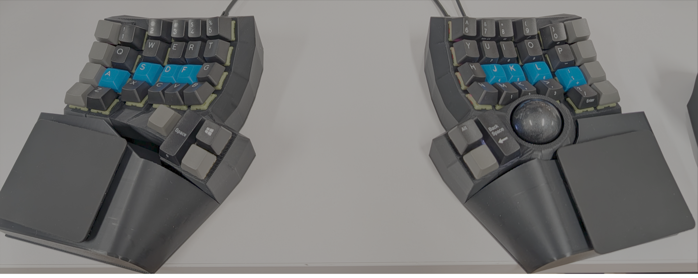

# Charb Kinetic V2



A split ergonomic keyboard generated with the [Cosmos keyboard generator](https://ryanis.cool/cosmos), with a PMW3389 trackball on the right side, per-key RGB, and a [VIK](https://github.com/sadekbaroudi/vik) expansion connector on each half.

## Hardware

- **MCU**: 2x RP2040
- **Layout**: 55 keys (6x4 per side + thumb clusters)
- **Trackball**: PMW3389 (right side only), 1800 CPI
- **RGB**: 98 WS2812 LEDs (49 per side), with a power relay on GP11
- **Communication**: Full-duplex USART
- **Handedness**: EE_HANDS (stored in EEPROM)
- **Expansion**: VIK connector (SPI, I2C, 2x GPIO, WS2812)

## Wiring

### Matrix Pins (Both Sides)

| Function | GPIO Pin |
| -------- | -------- |
| Column 0 | GP25     |
| Column 1 | GP24     |
| Column 2 | GP23     |
| Column 3 | GP22     |
| Column 4 | GP21     |
| Column 5 | GP20     |
| Column 6 | GP10     |
| Row 0    | GP3      |
| Row 1    | GP4      |
| Row 2    | GP5      |
| Row 3    | GP6      |
| Row 4    | GP7      |
| Row 5    | GP8      |
| Row 6    | GP9      |

Diode direction is **ROW2COL**.

### Split Communication

| Function | GPIO Pin |
| -------- | -------- |
| UART TX  | GP0      |
| UART RX  | GP1      |

### VIK Connector

| Function   | GPIO Pin |
| ---------- | -------- |
| SPI SCK    | GP14     |
| SPI MOSI   | GP15     |
| SPI MISO   | GP12     |
| SPI CS     | GP13     |
| I2C SDA    | GP18     |
| I2C SCL    | GP19     |
| GPIO 1     | GP26     |
| GPIO 2     | GP27     |
| WS2812 DI  | GP2      |

### Trackball (Right Side Only - PMW3389 via SPI1)

The trackball rides on the VIK SPI bus:

| Sensor Pin | GPIO Pin | Function    |
| ---------- | -------- | ----------- |
| SCK        | GP14     | SPI1 SCK    |
| MOSI       | GP15     | SPI1 TX     |
| MISO       | GP12     | SPI1 RX     |
| CS         | GP13     | Chip Select |

Rotated 90° with the Y axis inverted to match the physical mounting.

### RGB

| Function        | GPIO Pin |
| --------------- | -------- |
| WS2812 Data     | GP2      |
| LED Power Relay | GP11     |

The relay cuts power to the LED strip when RGB brightness drops to zero, so the LEDs don't idle-draw when they're "off".

## Building

```bash
qmk compile -kb cosmos/charbkineticv2 -km default
```

## Flashing

Put the RP2040 into bootloader mode by double-tapping the reset button, then copy the `.uf2` file to the mounted drive.

This board uses **EE_HANDS**, so handedness has to be written to EEPROM once per side:

```bash
# Left side
qmk flash -kb cosmos/charbkineticv2 -km default -bl uf2-split-left

# Right side
qmk flash -kb cosmos/charbkineticv2 -km default -bl uf2-split-right
```

After that you can flash either side normally. You only need to redo this if you clear EEPROM.

## Features

- Auto mouse layer (layer 3) — activates when the trackball is used
- Drag scroll — hold `DRG_SCRL` on the left thumb (mouse layer) to turn trackball movement into scrolling
- Timeless home row mods (`CHORDAL_HOLD` + `FLOW_TAP_TERM` + `PERMISSIVE_HOLD`)
- VIA support
- RGB underglow with automatic LED power cutoff

## VIK

The `vik/` folder is vendored from [sadekbaroudi's fingerpunch VIK resources](https://github.com/sadekbaroudi/qmk_firmware/tree/develop_fingerpunch/keyboards/fingerpunch/src/vik) — see [vik/README.md](vik/README.md). Don't hand-edit it; re-copy from upstream to update. To add a VIK module, set its flag in `rules.mk` (e.g. `VIK_CIRQUE_RIGHT = yes`) and the makefile cascade enables the matching driver and defines.
